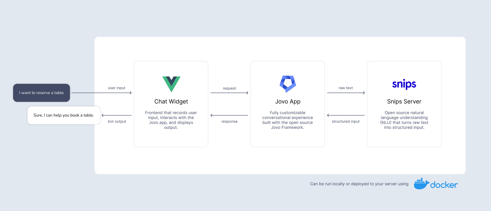
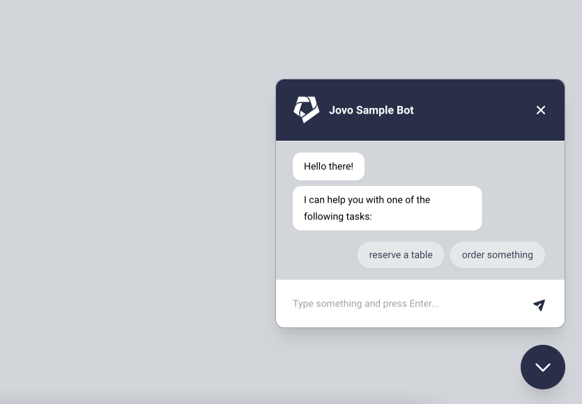

# Jovo Docker Example



This sample repository allows you to run a chatbot built with Jovo, Vue.js, and Snips NLU with a single command using Docker.

The project contains:

- `app`: A conversational backend built with the [Jovo Framework](https://www.jovo.tech)
- `chatwidget`: A Vue.js chat widget (based on the [Jovo Web Client](https://www.jovo.tech/marketplace/client-web-vue2)) that interacts with the conversational backend
- `snips-nlu-server`: An open source natural language understanding (NLU) service that turns raw text into structured input. You can also find the module here: https://github.com/jovotech/snips-nlu-server


## Getting Started

Use the following commands to clone the repository (make sure to add `--recurse-submodules` to download the submodule) and run it using [Docker](https://www.docker.com/get-started/):

```sh
# Clone this repository and download snips-nlu-server submodule from https://github.com/jovotech/snips-nlu-server
$ git clone --recurse-submodules https://github.com/jovotech/jovo-docker-example.git
$ cd jovo-docker-example

# Start Docker container
$ docker-compose up
```

You can then access the chat widget at `localhost:8080`:



If you make changes to the widget that don't show up immediately, you can stop the Docker service and start it again. Make sure to add the `--build` flag to rebuild the images:

```sh
# Rebuild and start Docker container
$ docker-compose up --build
```
